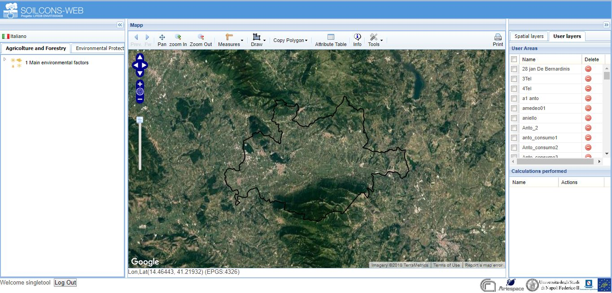
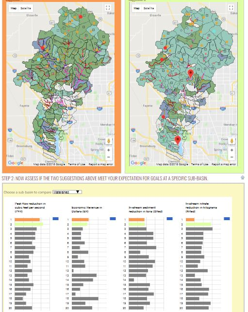

# proposal

# InterACTWEL

## Group members
##### Majid Farahani: hosseinm@oregonstate.edu
##### Hoda Tahami: tahamih@oregonstate.edu

## Description of our project
The limited nature of our shared resources drives the need for assistance to effectively coordinate demand,
 allocation, and efficient use of water, energy, and land within communities. This reality, compounded by threatened
 resource quality, requires coordination among stakeholders whose livelihoods depend on food and energy production and
 availability of water for consumptive and non- consumptive uses; these include: farmers, tribes, water managers, dam
 operators, industries, recreationalists, government agencies, and environmentalists. **InterACTWEL**, a secure and
  intelligent computer-aided decision support tool, empowers such actors to collaborate and coordinate management of natural
   resources over time. This highly flexible and navigable tool can be utilized in times of environmental disturbance or
    during implementation of new agricultural or environmental policies. Its intuitive interface examines impacts to goals,
    operations, and livelihoods for smarter natural resource management (i.e. adaptive management). To do so, this tool
     contains advanced scientific models and interactive optimization algorithms that allow individual actors to identify
      potential adaptation strategies while learning how those strategies affect other actors.

## Data:

1. http://www.oregon.gov/owrd/Pages/maps/index.aspx
2. https://www.nrcs.usda.gov/wps/portal/nrcs/main/or/technical/dma/gis/
3. https://water.usgs.gov/maps.html

## Interface Design:
#### project name:
1. **SoilConsWeb:**
The Project aims to develope, test and implement a tool to support the decisions of stakeholders on soil
 and landscapes conservation issues (Spatial-DSS)
http://soilconsweb.ariesgeo.com/index.php?lang=inglese
#

#
2. **WRESTORE** is a web-based, user-friendly, interactive, transparent, and participatory decision
 support system for helping land owners, government agencies, policy makers, planners, and other stakeholders
  design a distributed system of conservation practices in their watersheds.
http://wrestore.iupui.edu/
#

#

